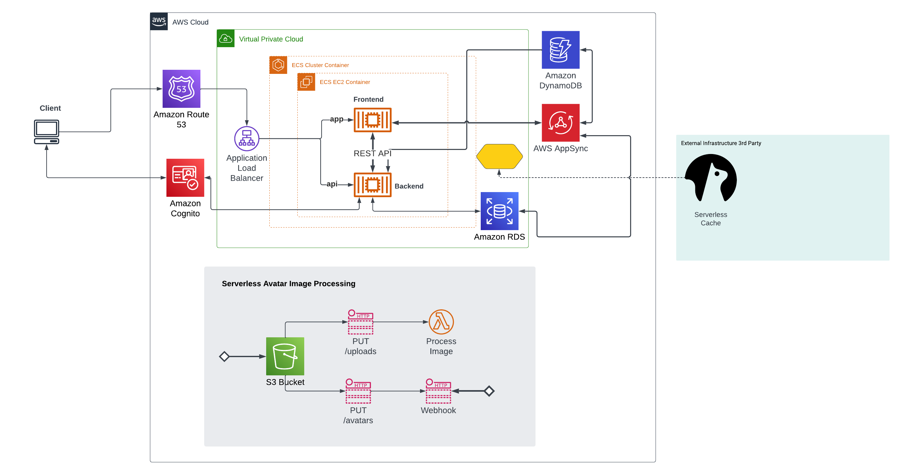

# Week 0 — Billing and Architecture

- Application: Cruddur
- Cohort: 2023-A1
- Paul Osei Kofi

Week 0 started slowly, as I could not join the live stream. I caught it later in the week to watch most of the videos. Despite my current level, I was lost for the most part since I barely do stuff related to coming up with architectural designs and all things surrounding it.

I already had an AWS account, so things like creating an IAM user and getting credentials were a breeze. The only challenge was buying a domain. I added a Billing alarm and created a budget, and I will say all the things needed on AWS for week one. I managed to get them to work.

Below is an image and link to my conceptual diagram

[Conceptual Diagram Link](https://lucid.app/lucidchart/fcea6349-aa90-49c2-bc3f-a470053b8a82/edit?viewport_loc=-398%2C-29%2C2535%2C1350%2C0_0&invitationId=inv_ff62798b-3dc0-499a-a45a-f2408fbe1a07)